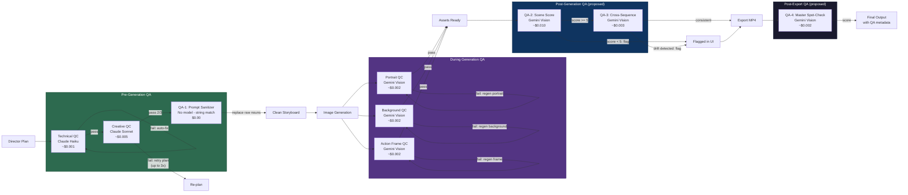

# D&D Shorts Factory — CTO Brief

**Date:** February 28, 2026
**Status:** Phase 7B complete. Framing intelligence + session context + campaign cards live.
**Prepared for:** Connor (CEO / DM / Creative Director)

---

## What This App Does (The Elevator Pitch)

You upload a Zoom transcript (`.vtt` file) from your D&D session. The app watches 3+ hours of conversation, picks out the 7 most cinematic moments, and turns whichever one you choose into a sequence of animated pixel art scenes — ready for YouTube Shorts.

The app now understands campaign context, translates fantasy proper nouns into visual descriptions for the image model, and frames each moment with the right structural strategy (cold open, stakes-then-payoff, character showcase, etc.). It also intelligently detects the DM recap even when sessions start with 15 minutes of pre-game banter.

No editing software needed for the raw output. You get: pixel art character portraits that talk, atmospheric backgrounds, close-up action shots, and DM narration sequences — all stitched together and concatenated into a vertical 9:16 video.

**Total cost per moment: ~$0.50–$0.80**
**Total time per moment: ~8–12 minutes** (mostly waiting for AI image generation)

---

## How It Works — Full Pipeline

```mermaid
flowchart TD
    subgraph UPLOAD["Upload and Parse"]
        A["Drop .vtt file from Zoom"] --> B["VTT Parser"]
        B --> C["Structured transcript\n(speakers, timestamps, cues)"]
    end

    subgraph DATA["Campaign Data"]
        CD[("Campaign Context Cards\n(locations, factions,\nworld concepts)")] -.-> SS
        CD -.-> DIR
    end

    subgraph ANALYSIS["Parallel Analysis"]
        C --> D["Claude Haiku\nHighlight Discovery\n(chunks if >20K tokens)"]
        C --> SS["Claude Haiku\nSession Summary Card\n(smart recap window)"]
        D --> E["7 ranked moments\n(title, type, emotional arc,\nframing strategy, hookLine)"]
        SS --> SSC["Session Summary\n(setting, stakes, party,\nproper noun translations)"]
    end

    subgraph PICK["Moment Selection"]
        E --> F["You pick a moment\n+ optional creative direction"]
        F --> G{"Start Director AI"}
    end

    subgraph DIRECTOR["Director AI"]
        SSC -.-> H
        SSC -.-> I
        G --> H["Scene Context Builder\n(Claude Sonnet)\n10-min transcript window\nsetting, enemies, positioning\n+ proper noun translations"]
        H --> I["Sequence Planner\n(Claude Sonnet)\n4-8 sequences with framing:\nestablishing, dialogue,\nDM narration, close-up, impact\n+ dmSetupLine, hookLine"]
        I --> J["Technical QC\n(Claude Haiku)\ntiming math, field validation"]
        J --> K["Creative QC\n(Claude Sonnet)\npacing, character fidelity,\nscene coherence"]
        K --> L{"2 of 3\ndimensions\npass?"}
        L -- No --> I
        L -- Yes --> SAN
    end

    subgraph SANITIZE["Prompt Sanitization"]
        SAN["QA-1: Prompt Sanitizer\n(zero cost)\nAuto-replace raw proper nouns\nwith visual translations"] --> M["Storyboard ready"]
    end

    subgraph EDIT["Human Review"]
        M --> N["Storyboard Editor\n(reorder, edit descriptions,\nadd/delete sequences,\nchange types and transitions)"]
        N --> O["Save and Generate"]
    end

    subgraph GENERATE["Pixel Art Generation"]
        O --> P["For each sequence:"]
        P --> Q["Establishing Shot\n1 Gemini background"]
        P --> R["Dialogue\nportrait + 2 mouth variants\n+ background"]
        P --> S["DM Narration\nnarrator portrait + text"]
        P --> T["Close-Up Action\n3-5 action frames\n(bounce animation)"]
        P --> U["Impact\npure CSS effect"]
    end

    subgraph QA["Visual Quality Assurance"]
        Q --> BQC["Background QC\n(Gemini Vision)\nsetting accuracy, no baked text"]
        R --> PQC["Portrait QC\n(Gemini Vision)\nconsistency, expression match"]
        T --> AQC["Action Frame QC\n(Gemini Vision)\nframe consistency, style match"]
        BQC --> BFIX{"Pass?"}
        PQC --> PFIX{"Pass?"}
        AQC --> AFIX{"Pass?"}
        BFIX -- No --> BREGEN["Regenerate background\nwith issue feedback"]
        PFIX -- No --> PREGEN["Regenerate portrait\n+ mouth variants"]
        AFIX -- No --> AREGEN["Regenerate action frame\nwith coherence feedback"]
        BFIX -- Yes --> ASSETS
        PFIX -- Yes --> ASSETS
        AFIX -- Yes --> ASSETS
        BREGEN --> ASSETS
        PREGEN --> ASSETS
        AREGEN --> ASSETS
        U --> ASSETS["All assets ready"]
    end

    subgraph SCORE["Scene Scoring (proposed)"]
        ASSETS --> CS["QA-2: Scene Composition\n(Gemini Vision)\nportrait + background score"]
        CS --> CCS["QA-3: Cross-Sequence\nConsistency\n(Gemini Vision, 1 call)"]
    end

    subgraph EXPORT["Export"]
        CCS --> X["HTML Assembly\n(self-contained templates)"]
        X --> Y["Puppeteer captures frames\nffmpeg encodes MP4"]
        Y --> Z["Per-sequence MP4s\n+ Master MP4 concat"]
        Z --> SPOT["QA-4: Master Spot-Check\n(Gemini Vision, 3 frames)\nfinal confidence score"]
        SPOT --> FINAL["Final output\n1080x1920 9:16 vertical"]
    end

    style UPLOAD fill:#1a1a2e,color:#fff,stroke:#16213e
    style DATA fill:#0f3460,color:#fff,stroke:#16213e
    style ANALYSIS fill:#1a1a2e,color:#fff,stroke:#16213e
    style PICK fill:#0f3460,color:#fff,stroke:#16213e
    style DIRECTOR fill:#533483,color:#fff,stroke:#16213e
    style SANITIZE fill:#2d6a4f,color:#fff,stroke:#16213e
    style EDIT fill:#0f3460,color:#fff,stroke:#16213e
    style GENERATE fill:#e94560,color:#fff,stroke:#16213e
    style QA fill:#533483,color:#fff,stroke:#16213e
    style SCORE fill:#2d6a4f,color:#fff,stroke:#16213e
    style EXPORT fill:#1a1a2e,color:#fff,stroke:#16213e
```

---

## Core Features (What's Built Today)

### 1. Transcript Intelligence
- Parses Zoom `.vtt` files (handles both speaker-labeled and auto-caption formats)
- Auto-detects the DM by speaking patterns
- Segments transcript into banter / recap / gameplay
- Chunks large transcripts (3hr+ sessions) for AI analysis

### 2. Moment Discovery
- Claude Haiku scans the full session and ranks 7 highlights
- Each moment gets: title, emotional arc, type (combat, roleplay, comedy, etc.), and a reason why it would make a good Short
- **Framing strategy** per moment: cold open, stakes-then-payoff, character showcase, comedic timing, or crescendo build
- **hookLine** and **dmSetupLine**: Pre-extracted dialogue lines for opening hooks and DM narration
- Deduplication prevents overlapping moments

### 3. Session Summary Cards *(NEW — Phase 7B)*
- **Parallel execution**: Runs alongside highlight finding via `Promise.all()` — zero added wall-clock time
- **Smart recap window**: Searches first ~300 cues for the actual DM recap using keyword detection ("last session", "welcome back") and DM monologue patterns (3+ consecutive DM cues). Skips pre-session banter automatically.
- Extracts: session setting, recent events, active stakes, party composition, emotional tone
- **Proper noun translations**: Every fantasy proper noun (Bazzoxan, Jewel of Three Prayers, Ruidium, etc.) mapped to a visual description optimized for image generation models
- Cost: ~$0.002 per session (Claude Haiku)

### 4. Campaign Context Cards *(NEW — Phase 7B)*
- Static JSON reference cards stored in `data/campaign/`
- Current: Call of the Netherdeep — 8 locations, 4 world concepts, 2 factions
- Every entry has a rich `visualDescription` written for image models (colors, textures, lighting, scale)
- Selectively loadable: `null` = all campaigns, `[]` = none, `['id']` = specific
- Fed into Session Summary AI for enriched context extraction

### 5. Scene Context Enrichment
- Before the Director plans anything, a separate AI pass analyzes a **10-minute window** around the chosen moment
- Extracts: where they are, what they're fighting, NPC descriptions, spatial positioning, DM narration quotes, emotional temperature
- **Proper noun translations** from session summary injected here — the Scene Context Builder knows "Bazzoxan" is a "dark basalt military outpost" before it describes the scene
- This context prevents the "random background" problem

### 6. Director AI (Sequence Planning)
- Claude Sonnet plans 4–8 sequences per moment
- Five sequence types: establishing shot, character dialogue, DM narration, action close-up, impact effect
- **Framing intelligence**: Applies the moment's framing strategy (cold open starts with action, stakes-then-payoff front-loads tension, etc.)
- **DM setup narration**: Automatically inserts a DM narration sequence before the main action to ground viewers
- **Proper noun visual references**: Receives `properNounTranslations` with explicit instruction to use visual descriptions instead of raw fantasy names
- Smart background reuse (dialogue scenes share the establishing shot's background)
- Smart portrait reuse (same character reuses cached portrait across sequences)
- Expression variants (same character with different emotion gets a new portrait generated from the base)
- DM/Narrator consistency (all DM sequences share one hooded-sage portrait)

### 7. Three-Layer Quality Control
- **Technical QC** (Claude Haiku): Validates timing math, required fields, cost estimates. Auto-fixes issues.
- **Creative QC** (Claude Sonnet): Checks three dimensions — cinematic pacing, character fidelity, scene coherence. Needs 2/3 to pass. Retries up to 3 times with feedback.
- **Prompt Sanitizer** *(proposed — QA-1)*: Zero-cost string matching to catch raw proper nouns that leaked through the Director's output before they reach image generation.

### 8. Interactive Storyboard Editor
- Full editing UI before any images are generated
- Reorder sequences by dragging, change types, edit descriptions, add/delete sequences
- Adjust durations, transitions (cut / fade / flash)
- See QC results (technical fixes, creative dimension scores)
- See scene context summary (collapsible)

### 9. Pixel Art Generation (Gemini)
- 16-bit SNES-era style (Octopath Traveler / Final Fantasy VI aesthetic)
- Portrait generation with automatic mouth animation variants (3-frame cycle)
- Action close-ups with bounce animation (3–5 frames, forward-and-back loop)
- All images include "no text" directive to prevent Gemini from baking in UI/labels
- Character portrait caching saves ~$0.12 per reuse
- Rate limiting (15s between Gemini calls) to avoid API throttling
- **Reference image support**: Portraits use saved portraits as visual anchors for cross-session character consistency

### 10. Visual Quality Assurance
- **Background QC** (Gemini Vision): Checks establishing shots and dialogue backgrounds against scene context. Catches wrong setting, baked-in text, style breaks. Auto-retries once with issue feedback.
- **Portrait QC** (Gemini Vision): Checks consistency and expression match. Auto-retries with `regeneratePortrait()` + new mouth variants when issues detected.
- **Action Frame QC** (Gemini Vision): Checks frame-to-frame consistency. Auto-retries individual frames with coherence feedback.
- **No-text enforcement**: Background QC specifically flags baked-in text, labels, UI elements, health bars, or watermarks as auto-retry issues.

### 11. Knowledge System
- **Persistent knowledge base** at `data/knowledge.json`: Characters (5 PCs), NPCs, Locations, Portrait index
- **Auto-entity extraction**: Claude Haiku scans DM narration after VTT analysis, discovers new NPCs/locations/creatures, auto-adds to KB
- **Cross-session portrait persistence**: Generated portraits saved to `data/portraits/`, indexed by entity + mood + quality. Best portrait retrieved as reference for future generations.
- **Director integration**: Director AI receives full NPC/location context alongside character cards for richer scene planning
- **Quality scale**: 0 = gold standard (commissioned art), 1 = good AI generation, 2 = uncertain/needs review

### 12. Template-Driven Animation
- Three HTML templates: dialogue, action-bounce, sequence-player
- All code-driven effects (no extra AI cost): typewriter text, mouth cycling, portrait bob, ambient particles, vignette, screen shake, mood-based color grading
- Subtle ambient brightness drift (smooth, not flickering)
- Dialogue box positioned in YouTube Shorts safe zone

### 13. Export Pipeline
- Puppeteer headless Chrome captures animation frames at 12fps
- ffmpeg encodes to H.264 MP4 at 1080×1920
- Per-sequence MP4s + **master concatenated MP4** (all sequences stitched)
- Self-contained HTML files (all images embedded as base64)

---

## QA Strategy — "Cheap Checks Everywhere"

### The Philosophy

Image generation is **95% of the cost** per moment (~$0.45–0.57 out of ~$0.60). Every QA check that catches a problem *before* image generation saves 20–40× its own cost. A $0.002 Gemini Vision check that prevents a bad $0.04 background regeneration pays for itself 20× over.

We should be spending 5% on QA, not 2%. The marginal cost of adding more cheap checks is near zero, but the marginal value of catching one bad scene early is significant.

### Current QA (already built and running)

| Check | When | Model | Cost |
|-------|------|-------|------|
| Technical QC | After Director plans | Claude Haiku | ~$0.001 |
| Creative QC | After Director plans | Claude Sonnet | ~$0.005 |
| Portrait QC | After portrait generation | Gemini 2.5 Flash Vision | ~$0.002 |
| Background QC | After background generation | Gemini 2.5 Flash Vision | ~$0.002 |
| Action Frame QC | After action frame generation | Gemini 2.5 Flash Vision | ~$0.002 |
| **Current QA total** | | | **~$0.012/moment** |

### Proposed QA Enhancements

#### QA-1: Prompt Sanitizer — Zero Cost, Highest Value
- **When:** After Director plan finalized, before image generation begins
- **What:** String-scan every `backgroundDescription`, `portraitDescription`, and `actionDescription` in the storyboard. Check if any `properNounTranslations` keys appear as raw text. If "Bazzoxan" is in a description but the session summary says it should be "dark basalt military outpost with scarred walls under gray-green clouds," auto-substitute inline.
- **Model:** None — pure string matching
- **On failure:** Auto-replace. Log each substitution.
- **Cost:** $0.00
- **ROI:** Prevents garbage-in → saves $0.04–0.16 in wasted image generation when a raw proper noun produces a nonsensical image

#### QA-2: Scene Composition Score — Catch Bad Scenes Before Export
- **When:** After each sequence's assets are fully generated (portrait + background assembled)
- **What:** Send portrait + background composite to Gemini Flash Vision. Ask for a 1–10 score across: visual appeal, style consistency, description match.
- **Model:** Gemini 2.5 Flash Vision
- **On failure (score < 5):** Flag sequence in metadata. Show score in storyboard editor. Don't auto-retry (too expensive for marginal gain).
- **Cost:** ~$0.002/sequence → ~$0.010/moment
- **ROI:** Catches bad compositions before $0.02 export cost, provides quality signal for the user

#### QA-3: Cross-Sequence Consistency — Style Drift Detection
- **When:** After all sequences generated, before export
- **What:** Send one key frame from each sequence in a single multi-image call. "Do these look like consecutive scenes from the same video? Rate consistency 1–10."
- **Model:** Gemini 2.5 Flash Vision (1 call, 4–6 images)
- **On failure:** Flag in metadata. Informational only.
- **Cost:** ~$0.003/moment
- **ROI:** Style drift awareness — knows if the art style wandered between first and last sequence

#### QA-4: Master Video Spot-Check — Final Confidence Signal
- **When:** After master MP4 is concatenated
- **What:** Extract 3 frames via ffmpeg (25%/50%/75% through). Send to Gemini Flash Vision. "Rate overall quality 1–10."
- **Model:** Gemini 2.5 Flash Vision
- **On failure:** Score stored in metadata. Purely informational.
- **Cost:** ~$0.002/moment
- **ROI:** Final gut-check before delivering to the user

### QA Cost Summary

| Layer | Cost | Category |
|-------|------|----------|
| Current QA (built) | ~$0.012 | Running |
| QA-1: Prompt Sanitizer | $0.00 | Proposed — **Priority 1** |
| QA-2: Scene Composition | ~$0.010 | Proposed — Priority 2 |
| QA-3: Cross-Sequence | ~$0.003 | Proposed — Priority 3 |
| QA-4: Master Spot-Check | ~$0.002 | Proposed — Priority 3 |
| **All QA (existing + proposed)** | **~$0.027** | **Still <5% of gen cost** |

### Implementation Priority
1. **QA-1 (Prompt Sanitizer)** — implement immediately. Zero cost, prevents the #1 quality risk (raw proper nouns hitting Gemini).
2. **QA-2 (Scene Composition)** — implement next. Most actionable feedback.
3. **QA-3 + QA-4** — defer. Nice-to-have informational signals.

---

## QA Layer Map

This chart is designed for [mermaid.ai](https://mermaid.ai) — standard `flowchart LR` syntax.

---

## What's NOT Built (Known Gaps)

| Gap | Impact | Notes |
|-----|--------|-------|
| **No audio** | High | Output is silent video. Must be manually synced in Premiere. XML/EDL project file export wanted. |
| **Sessions are in-memory** | Medium | Server restart loses all sessions. State files exist but aren't reloaded. |
| **No batch/automated mode** | Low | One moment at a time, with human review at each step. |
| **ZIP download broken for pixel art** | Low | Download endpoint still uses legacy structure. |
| **No prompt sanitizer yet** | Medium | Director is *instructed* to use proper noun translations, but no validation it actually does. Raw nouns can leak to Gemini. (QA-1 proposed above) |
| ~~No final stitched video~~ | ✅ Done | Master MP4 concatenation works. |
| ~~No reference image support~~ | ✅ Done | Phase 6E: cross-session portrait persistence. |
| ~~No image database/reuse~~ | ✅ Done | Phase 6D: portraits saved and indexed in knowledge base. |
| ~~No location/NPC cards~~ | ✅ Done | Phase 6: full knowledge base. |
| ~~No session context~~ | ✅ Done | Phase 7B: session summary cards + campaign context cards. |
| ~~Recap window too small~~ | ✅ Done | Smart recap detection searches first 300 cues for DM recap. |

---

## Cost Breakdown

### Per Moment (End-to-End)

| Step | Model | Cost |
|------|-------|------|
| Highlight discovery (shared across 7 moments) | Claude Haiku | ~$0.04 share |
| Session summary (parallel, shared) | Claude Haiku | ~$0.002 share |
| Scene context | Claude Sonnet | ~$0.02 |
| Sequence planning | Claude Sonnet | ~$0.03 |
| Technical QC | Claude Haiku | ~$0.001 |
| Creative QC | Claude Sonnet | ~$0.02 |
| **AI Planning subtotal** | | **~$0.11** |
| Establishing shot (1 background) | Gemini Flash | $0.04 |
| Dialogue sequences (2–3 × portrait + mouth variants) | Gemini Flash | $0.24–0.36 |
| Close-up action (4 frames) | Gemini Flash | $0.16 |
| Visual QC checks (portrait, background, action) | Gemini Flash Vision | ~$0.01 |
| Proposed QA (sanitizer + scoring + spot-check) | Gemini Flash Vision / None | ~$0.015 |
| **Image Generation subtotal** | | **~$0.45–0.57** |
| **Total per moment** | | **~$0.55–0.70** |

### At Scale
- 7 moments per session × $0.63 avg = **~$4.40 per session** (if you generated all 7)
- Typical use: 1–2 moments per session = **$0.63–$1.26**

---

## Technology Stack

| Layer | Technology |
|-------|-----------|
| Server | Node.js (ES modules) + Express |
| AI — Text/Planning | Anthropic Claude (Haiku for cheap tasks, Sonnet for creative tasks) |
| AI — Image Generation | Google Gemini 3.1 Flash Image Preview |
| AI — Vision QC | Google Gemini 2.5 Flash |
| AI — Session Summary | Anthropic Claude Haiku (parallel with highlight discovery) |
| Campaign Data | Static JSON cards in `data/campaign/` |
| Knowledge Base | `data/knowledge.json` (characters, NPCs, locations, portraits) |
| Animation | HTML/CSS/JS templates with code-driven effects |
| Video Capture | Puppeteer (headless Chrome) |
| Video Encoding | ffmpeg (H.264, 1080×1920) |
| Frontend | Vanilla HTML/CSS/JS (no framework) |

---

## Roadmap

### ✅ Phase 5: Visual QA + Auto-Retry — COMPLETE
- Background QC with Gemini Vision (establishing shots + dialogue/DM backgrounds)
- Portrait QC promoted from log-only to actionable retry
- No-text enforcement as auto-retry trigger
- Scene context threaded through entire generation pipeline
- Director AI given structural flexibility (skip establishing shot, reorder, etc.)

### ✅ Phase 6: Knowledge System — COMPLETE
- `data/knowledge.json` — persistent knowledge base with Characters, NPCs, Locations, Portrait index
- Auto-entity extraction from DM narration (Claude Haiku)
- Cross-session portrait persistence (`data/portraits/` + quality-sorted retrieval)
- Reference image support in `generateCharacterPortrait()`
- Director integration with NPC/location context injection

### ✅ Phase 7A: Framing Overhaul — COMPLETE
- 5 framing strategies: cold open, stakes-then-payoff, character showcase, comedic timing, crescendo build
- hookLine / dmSetupLine fields on every moment
- DM setup narration auto-inserted by Director
- Framing strategy drives sequence order and pacing

### ✅ Phase 7B: Session Summary + Campaign Context — COMPLETE
- Session summary cards (parallel Haiku call, ~$0.002, zero added time)
- Campaign context cards (Call of the Netherdeep: 8 locations, 4 concepts, 2 factions)
- Proper noun translations flowing through: session summary → scene context → Director
- Smart recap window detection (searches first 300 cues instead of fixed 50)

### Phase 8: QA Enhancement ("Cheap QA Everywhere")
**Lift: Small–Medium | Value: High | Dependencies: Phase 7B ✅**

> See "QA Strategy" section above for full proposal.

- **QA-1: Prompt Sanitizer** — zero-cost string matching to catch raw proper nouns before image generation
- **QA-2: Scene Composition Score** — Gemini Vision scoring of assembled scenes
- QA-3: Cross-Sequence Consistency — style drift detection across sequences
- QA-4: Master Video Spot-Check — final confidence score on concatenated MP4

**Estimated effort:** 1 session

---

### Phase 9: Image Database & Tagging (Browse + Reuse UI)
**Lift: Medium | Value: Medium-High | Dependencies: Phase 6 ✅**

- Image browser UI (search by character, mood, location)
- Pre-generation lookup: "Do we already have this?" in storyboard editor
- "Reuse" button on portrait/background assets
- Background image tagging and reuse (not just portraits)

**Estimated effort:** 2 sessions

---

### Phase 10: Audio & Video Clip Extraction
**Lift: Medium | Value: Very High | Dependencies: None**

- Point app at source Zoom recording → ffmpeg extracts clip using moment timestamps
- Audio normalization pass
- Output: `moment_*/source-clip.mp4` alongside pixel art MP4s
- **Premiere project file (XML/EDL)**: pixel art clips + source clip on separate tracks, pre-aligned by timestamp

**Estimated effort:** 1–2 sessions

---

### Phase 11: Reference Art Integration (Commissioned Art Pipeline)
**Lift: Medium | Value: High | Dependencies: Phase 6 ✅**

- Commission 5 character portraits (external work)
- Upload UI for reference images → stored in entity's `referenceImages[]`
- Set quality to 0 (gold standard) — takes priority in `findBestPortrait()`
- A/B comparison UI: side-by-side of reference vs. generated

**Estimated effort:** 1 session (engineering) + commission time

---

### Phase 12: Full Shorts Assembly (Dream Goal)
**Lift: Very High | Value: Transformative | Dependencies: Phase 10**

Start with **Phase 10.5**: rough-cut Premiere project file with pixel art + source audio on separate tracks, markers at moment boundaries. Human makes final editorial decisions in 5–10 minutes instead of 30+.

Full autonomous assembly (audio analysis, scene composition rules, editorial judgment) is a 10x harder problem — punt unless Phase 10.5 proves insufficient.

**Estimated effort:** 4–6 sessions for rough cut, 10+ for autonomous assembly

---

## CEO Decisions (Answered)

1. **Reference art priority**: Build knowledge system first, add reference image support in the infrastructure. Commission art later. ✅ Done — Phase 6E has reference image support ready.

2. **Source recording format**: Punted to later. Audio/video clip extraction (Phase 10) deferred.

3. **NPC persistence**: Auto-creation chosen. System auto-extracts NPCs/locations from DM narration and adds to knowledge base with `autoGenerated: true`. User reviews later. ✅ Done — Phase 6C.

4. **Cross-session continuity**: Yes — cross-session portrait persistence. Saved portraits used as visual anchors for future generations. ✅ Done — Phase 6D.

5. **Premiere integration**: XML/EDL project file wanted. Deferred to Phase 10.

6. **Budget**: Under $1 per moment is fine. Current cost: ~$0.55–$0.70 per moment depending on sequence count and retries.

7. **QA Budget**: Under 5% of generation cost. Proposed additions total ~$0.015/moment → well within budget. Pending approval.
